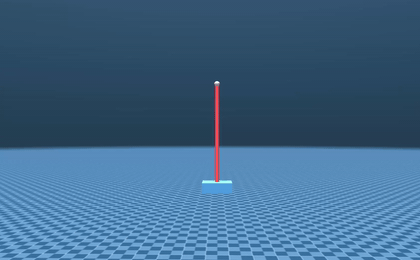

# OCS2 MuJoCo Control Framework

A comprehensive framework for Model Predictive Control (MPC) of various robotic systems using [OCS2](https://leggedrobotics.github.io/ocs2/) and [MuJoCo](https://mujoco.org/) simulation.

## Demo Videos

| ANYmal C | Unitree Go1 | Unitree Go2 |
|----------|-------------|-------------|
|  |  |  |

| Quadrotor NMPC | Cartpole Balance |
|----------------|------------------|
|  |  |

## 1. Summary

This project provides a complete framework for optimal control of legged robots and aerial vehicles using Model Predictive Control (MPC). It integrates OCS2's powerful optimization algorithms with MuJoCo's high-fidelity physics simulation, enabling real-time control of complex robotic systems.

### What's New (2026.01)

**Keyboard Controller Support**
- Added KeyboardController alongside Xbox controller for all packages
- Full keyboard control: WASD for movement, IJKL for height/yaw, number keys for mode selection
- No Xbox controller required - pure keyboard control available
- Works on all platforms including WSL2

**Enhanced Control Framework**
- Unified interface between Xbox and Keyboard controllers
- Non-blocking terminal input with smooth control decay
- Thread-based input processing for responsive control

### Key Features

- **Multiple Robot Support**: ANYmal C, Unitree Go1/Go2 quadrupeds, quadrotors, cartpole
- **Real-time MPC**: Using OCS2 Centroidal Model and DDP/SQP solvers  
- **Whole-Body Control**: Converts MPC outputs to joint torques via RNEA
- **MuJoCo Simulation**: High-fidelity physics simulation with interactive GUI
- **UDP Communication**: Modular architecture separating controller and simulator
- **Dual Input Support**: Xbox controller OR keyboard control
- **FSM Controller**: Finite State Machine for mode transitions (Passive, PD, Standing, Walking)
- **Multiple Gaits**: Trot, pace, bound, and custom walking patterns

### Tested Platforms

* **Ubuntu 22.04 LTS** - ROS2 Humble
* **Ubuntu 24.04 LTS** - ROS2 Jazzy  
* **WSL2** (Ubuntu 22.04) - ROS2 Humble
* **Linux x86_64** with NVIDIA GPU (recommended for visualization)

## 2. Architecture

```
┌──────────────────────────────────────────────────────────┐
│                 Controller (OCS2 )                      │
│  ┌──────────┐  ┌──────────┐  ┌─────────┐  ┌─────────┐  │
│  │   Xbox   │  │ Keyboard │  │   FSM   │  │   MPC   │  │
│  │Controller│  │Controller│──│ Manager │──│ Thread  │  │
│  └──────────┘  └──────────┘  └─────────┘  │(DDP/SQP)│  │
│        │             │             │       └─────────┘  │
│        └─────────────┴─────────────┤                    │
│                                    │                    │
│              ┌─────────────────────▼──────────────┐     │
│              │       Control Thread               │     │
│              │                                    │     |
│              └──────────────┬─────────────────────┘     │
└─────────────────────────────│────────────────────────────┘
                              │ UDP (State/Control)
┌─────────────────────────────▼────────────────────────────┐
│                    MuJoCo Simulator                      │
│  ┌────────────┐  ┌────────────┐  ┌──────────────────┐   │
│  │   Robot    │  │  Physics   │  │  Interactive GUI │   │
│  │   Model    │  │   Engine   │  │  with Callbacks  │   │
│  └────────────┘  └────────────┘  └──────────────────┘   │
└──────────────────────────────────────────────────────────┘
```

## 3. Packages

### Core Packages

| Package | Description | Features |
|---------|-------------|----------|
| `quadruped_nmpc` | Quadruped NMPC controller | Multi-robot (ANYmal/Go1/Go2), FSM, Gaits |
| `anymal_walking_online` | ANYmal walking control | MuJoCo GUI, Gait switching|
| `anymal_standing_online` | ANYmal standing control | MuJoCo GUI, Pose control|
| `ocs2_quadrotor_nmpc` | Quadrotor NMPC via UDP | Multiple targets, Joystick control |
| `quadrotor_online` | Quadrotor with GUI | Interactive MuJoCo, Real-time MPC |
| `ocs2_cartpole_upright` | Cartpole balance | UDP control |

### Support Packages

| Package | Description |
|---------|-------------|
| `anymal_centroidal` | ANYmal centroidal dynamics testing |
| `anymal_pinocchio` | ANYmal Pinocchio visualization |
| `quadrotor_offline` | Offline quadrotor trajectory optimization |
| `ocs2_ros2` | OCS2 core libraries (submodule) |

## 4. Dependencies

### 4.1 Prerequisites

* **Operating System**: Ubuntu 22.04 LTS (Jammy) or Ubuntu 24.04 LTS (Noble)
* **ROS2**: Humble (22.04) or Jazzy (24.04)
* **C++ Compiler**: GCC 11+ with C++17 support
* **CMake**: 3.14+
* **Git**: For cloning repositories

### 4.2 Required Libraries

| Library | Version | Purpose |
|---------|---------|---------|
| **Eigen3** | ≥3.3.9 | Linear algebra |
| **Boost** | ≥1.71 | Utilities (filesystem, system) |
| **Pinocchio** | ≥2.6 | Rigid body dynamics |
| **MuJoCo** | ≥3.0.0 | Physics simulation |
| **GLFW3** | ≥3.3 | OpenGL window management |
| **OCS2** | (submodule) | Optimal control framework |

### 4.3 Optional Dependencies

- **Xbox Controller**: For gamepad input (not required with keyboard support)
- **NVIDIA GPU**: Recommended for smooth visualization

## 5. Installation

### 5.1 Install ROS2

Follow the official [ROS2 installation guide](https://docs.ros.org/en/humble/Installation.html) for your Ubuntu version.

```bash
# Ubuntu 22.04 - ROS2 Humble
sudo apt install ros-humble-desktop

# Ubuntu 24.04 - ROS2 Jazzy  
sudo apt install ros-jazzy-desktop
```

### 5.2 Install System Dependencies

```bash
# Install required packages
sudo apt update
sudo apt install -y \
    build-essential \
    cmake \
    git \
    libeigen3-dev \
    libboost-all-dev \
    libglfw3-dev \
    libglfw3 \
    ros-${ROS_DISTRO}-pinocchio \
    ros-${ROS_DISTRO}-urdf \
    ros-${ROS_DISTRO}-kdl-parser
```

### 5.3 Install MuJoCo

```bash
# Download MuJoCo 3.3.0 (or latest)
wget https://github.com/google-deepmind/mujoco/releases/download/3.3.0/mujoco-3.3.0-linux-x86_64.tar.gz
tar -xzf mujoco-3.3.0-linux-x86_64.tar.gz
sudo mv mujoco-3.3.0 /usr/local/mujoco

# Add to environment (add to ~/.bashrc)
export MUJOCO_DIR=/usr/local/mujoco
export LD_LIBRARY_PATH=$LD_LIBRARY_PATH:$MUJOCO_DIR/lib
```

### 5.4 Clone and Build Workspace

```bash
# Create workspace
mkdir -p ~/ros2_ws_ocs2/src
cd ~/ros2_ws_ocs2/src

# Clone repository
git clone https://github.com/YOUR_USERNAME/ocs2_mujoco_control.git .
git submodule update --init --recursive

# Install ROS dependencies
cd ~/ros2_ws_ocs2
rosdep install --from-paths src --ignore-src -r -y

# Build workspace
source /opt/ros/${ROS_DISTRO}/setup.bash
colcon build --cmake-args -DCMAKE_BUILD_TYPE=Release --symlink-install

# Source workspace
source install/setup.bash
```

### 5.5 Build Simulator

```bash
# Build MuJoCo simulator
cd ~/ros2_ws_ocs2/simulate
mkdir -p build && cd build
cmake ..
make -j$(nproc)
```

## 6. Quick Start Examples

This section provides step-by-step instructions for running each example.

### 6.1 Quadruped Walking (ANYmal C)

<details>
<summary>🐕 Click to expand Quadruped Walking example</summary>

**Build:**
```bash
cd ~/ros2_ws_ocs2
source /opt/ros/${ROS_DISTRO}/setup.bash
colcon build --packages-select anymal_walking_online
source install/setup.bash
```

**Run:**
```bash
# Launch with MuJoCo GUI
./install/anymal_walking_online/lib/anymal_walking_online/anymal_walking_mujoco
```

**Controls:**

| Input | Action |
|-------|--------|
| **Mode Selection** |
| 1 | PASSIVE mode (motors off) |
| 2 | PD_CONTROL (stand up with PD) |
| 3 | STANDING mode (MPC control) |
| 4 | WALKING mode (MPC + Gait) |
| **Movement (WASD)** |
| W/S | Forward/Backward velocity |
| A/D | Left/Right strafe |
| I/K | Height up/down |
| J/L | Yaw rotation |
| **Commands** |
| Enter | Toggle MPC on/off |
| G | Switch gait (Trot→Pace→Bound) |
| -/= | Adjust height preset |
| Q | Emergency stop |
| Space | Reset velocities to zero |

**Available Gaits:**
- Trot (default)
- Pace
- Bound
- Flying Trot

</details>

### 6.2 Quadruped Standing (ANYmal C)

<details>
<summary>🦿 Click to expand Quadruped Standing example</summary>

**Build:**
```bash
colcon build --packages-select anymal_standing_online
source install/setup.bash
```

**Run:**
```bash
./install/anymal_standing_online/lib/anymal_standing_online/anymal_standing_mujoco
```

**Controls:**

| Input | Action |
|-------|--------|
| 1 | STANDING mode |
| 2 | PASSIVE mode |
| 3 | RECOVERY mode |
| W/S/A/D | Body position X/Y |
| I/K/J/L | Height / Yaw |
| R | Reset to default pose |
| Enter | Toggle MPC |

</details>

### 6.3 Quadruped NMPC (Multi-Robot)

<details>
<summary>🤖 Click to expand Multi-Robot Quadruped example</summary>

**Build:**
```bash
colcon build --packages-select quadruped_nmpc
source install/setup.bash
```

**Run with UDP Simulator:**

Terminal 1 - Simulator:
```bash
cd simulate/build
./ocs2_mujoco anymal_c  # or: unitree_go1, unitree_go2
```

Terminal 2 - Controller:
```bash
source install/setup.bash
./install/quadruped_nmpc/lib/quadruped_nmpc/quadruped_nmpc_main 0
# Arguments: 0=ANYmal-C, 1=Unitree-Go1, 2=Unitree-Go2
```

**Supported Robots:**
- ANYmal C (ANYbotics)
- Unitree Go1
- Unitree Go2

</details>

### 6.4 Quadrotor Interactive

<details>
<summary>🚁 Click to expand Quadrotor example</summary>

**Build:**
```bash
colcon build --packages-select quadrotor_online
source install/setup.bash
```

**Run:**
```bash
./install/quadrotor_online/lib/quadrotor_online/quadrotor_interactive_gui
```

**Controls:**

| Input | Action |
|-------|--------|
| 1-4 | Select target position |
| W/S | Move forward/backward |
| A/D | Move left/right |
| I/K | Move up/down |
| J/L | Rotate yaw |
| Enter | Toggle run/pause |
| Space | Reset position |

**Features:**
- Real-time MPC trajectory optimization
- Interactive target selection via UI
- Smooth joystick/keyboard control

</details>

### 6.5 Quadrotor NMPC (UDP)

<details>
<summary>🛸 Click to expand Quadrotor NMPC example</summary>

**Build:**
```bash
colcon build --packages-select ocs2_quadrotor_nmpc
source install/setup.bash
```

**Run with UDP Simulator:**

Terminal 1 - Simulator:
```bash
cd simulate/build
./ocs2_mujoco quadrotor
```

Terminal 2 - Controller:
```bash
./install/ocs2_quadrotor_nmpc/lib/ocs2_quadrotor_nmpc/ocs2_quadrotor_nmpc_udp
```

**Features:**
- UDP communication between controller and simulator
- Multiple preset targets
- Velocity-based joystick control

</details>

### 6.6 Cartpole Balance

<details>
<summary>🛒 Click to expand Cartpole example</summary>

**Build:**
```bash
colcon build --packages-select ocs2_cartpole_upright
source install/setup.bash
```

**Run:**

Terminal 1 - Simulator:
```bash
cd simulate/build
./ocs2_mujoco cartpole
```

Terminal 2 - Controller:
```bash
./install/ocs2_cartpole_upright/lib/ocs2_cartpole_upright/cartpole_udp_nmpc
```

**Features:**
- Swing-up and balance control
- Real-time MPC stabilization
- Classic control benchmark

</details>
colcon build --cmake-args -DCMAKE_BUILD_TYPE=Release --symlink-install

# Source workspace
source install/setup.bash
```

### 5.5 Build Simulator (Optional)

```bash
# Build MuJoCo simulator
cd ~/ros2_ws_ocs2/simulate
mkdir -p build && cd build
cmake ..
make -j$(nproc)
```

## 7. Input Control Reference

### 7.1 Keyboard Controls

All packages support full keyboard control without requiring Xbox controller:

| Category | Key | Function |
|----------|-----|----------|
| **Movement** | W | Forward |
| | S | Backward |
| | A | Strafe left |
| | D | Strafe right |
| **Altitude/Yaw** | I | Up/Height increase |
| | K | Down/Height decrease |
| | J | Rotate left (yaw) |
| | L | Rotate right (yaw) |
| **Mode Selection** | 1 | Mode 1 (PASSIVE/Target 1) |
| | 2 | Mode 2 (PD_CONTROL/Target 2) |
| | 3 | Mode 3 (STANDING/Target 3) |
| | 4 | Mode 4 (WALKING/Target 4) |
| **Commands** | Enter | Start/Toggle MPC |
| | Space | Reset stick values |
| | Q | Emergency stop (legged robots) |
| | G | Switch gait (walking mode) |
| | - | Decrease height preset |
| | = | Increase height preset |
| | R | Reset to default pose |

### 7.2 Xbox Controller Mapping

Xbox controller provides the same functionality through analog sticks and buttons:

| Input | Quadruped | Quadrotor |
|-------|-----------|-----------|
| **Left Stick** | X/Y velocity | X/Y position |
| **Right Stick** | Yaw / Height | Yaw / Z position |
| **A Button** | PASSIVE mode | Target 1 |
| **B Button** | PD_CONTROL | Target 2 |
| **X Button** | STANDING | Target 3 |
| **Y Button** | WALKING | Target 4 |
| **Start** | Toggle MPC | Run/Pause |
| **D-Pad** | Gait selection | - |
| **LB/RB** | Height preset | - |

## 8. Configuration Files

### 8.1 MPC Configuration

| File | Description |
|------|-------------|
| `config/mpc/task.info` | MPC cost weights, horizons, solver settings |
| `config/mpc/ddp.info` | DDP solver parameters |
| `config/mpc/sqp.info` | SQP solver parameters |
| `config/mpc/ipm.info` | Interior Point Method settings |

### 8.2 Gait Configuration

| File | Description |
|------|-------------|
| `config/command/gait.info` | Gait cycle definitions (duty factor, phase) |
| `config/command/mode_schedule.info` | FSM mode transitions |
| `config/command/target_trajectories.info` | Reference trajectories |

### 8.3 Robot Configuration

| File | Path | Description |
|------|------|-------------|
| URDF | `robots/*/urdf/*.urdf` | Robot kinematic structure |
| MuJoCo Model | `robots/*/mujoco/*.xml` | Simulation model |
| Joint Limits | `config/robots/*/joint_limits.info` | Actuator constraints |

## 9. Supported Robots

### 9.1 Quadrupeds

| Robot | DOF | Mass | Features |
|-------|-----|------|----------|
| **ANYmal C** | 12 | 50 kg | Hydraulic actuators, high payload |
| **Unitree Go1** | 12 | 12 kg | Consumer-grade, affordable |
| **Unitree Go2** | 12 | 15 kg | Improved Go1, better sensors |

### 9.2 Aerial Vehicles

| Robot | DOF | Control | Features |
|-------|-----|---------|----------|
| **Quadrotor** | 6 (SE(3)) | 4 motors | X-configuration, aggressive maneuvers |

### 9.3 Others

| Robot | DOF | Type | Features |
|-------|-----|------|----------|
| **Cartpole** | 2 | Underactuated | Swing-up, balance control |

## 10. Troubleshooting

### 10.1 Common Issues

<details>
<summary>Build errors with OCS2</summary>

```bash
# Clean and rebuild
cd ~/ros2_ws_ocs2
rm -rf build/ install/ log/
colcon build --cmake-args -DCMAKE_BUILD_TYPE=Release
```
</details>

<details>
<summary>MuJoCo library not found</summary>

```bash
# Ensure MuJoCo is in library path
export LD_LIBRARY_PATH=$LD_LIBRARY_PATH:/usr/local/mujoco/lib
# Add to ~/.bashrc to make permanent
echo 'export LD_LIBRARY_PATH=$LD_LIBRARY_PATH:/usr/local/mujoco/lib' >> ~/.bashrc
```
</details>

<details>
<summary>Keyboard input not working</summary>

- Make sure terminal has focus (click on terminal window)
- Try running with `sudo` if permission issues
- Check that termios is properly configured
</details>

<details>
<summary>Robot falls immediately</summary>

- Press appropriate mode key (3 for STANDING, 4 for WALKING)
- Wait for MPC to initialize (1-2 seconds)
- Check that MPC is enabled (press Enter to toggle)
</details>

### 10.2 Performance Tips

- **Use Release build**: `-DCMAKE_BUILD_TYPE=Release` gives 10x speedup
- **Adjust MPC horizon**: Shorter horizon = faster computation
- **Reduce visualization FPS**: Lower render rate if simulation is slow
- **Use GPU**: NVIDIA GPU significantly improves visualization

## 11. Advanced Usage

### 11.1 Custom Robot Integration

See [doc/CUSTOM_ROBOT.md](doc/CUSTOM_ROBOT.md) for detailed guide on adding new robots.

### 11.2 Tuning MPC Parameters

Key parameters to tune in `config/mpc/task.info`:

```ini
; Cost weights
stateWeight              ; Tracking error penalty
inputWeight              ; Control effort penalty
endEffectorWeight        ; Foot position tracking

; Timing
mpc.timeHorizon          ; Prediction horizon (s)
mpc.dt                   ; Discretization timestep

; Solver
ddp.maxNumIterations     ; Max DDP iterations
sqp.maxNumIterations     ; Max SQP iterations
```

### 11.3 Custom Gaits

Edit `config/command/gait.info` to define custom gaits:

```ini
; Example: Custom trot gait
[trot]
numLegs              4
cycleTime            0.5           ; Total cycle duration
dutyFactor           0.6           ; Stance phase ratio
phaseOffset          0.0 0.5 0.5 0.0  ; LF RF LH RH
```

## 12. Documentation

- [MATH DOC](doc/quadruped_doc/00_INDEX.md.md) - In-depth system design

## 13. Related Projects

- [OCS2 ROS2](https://github.com/legubiao/ocs2_ros2) -  OCS2 ROS2 
- [OCS2](https://github.com/leggedrobotics/ocs2) OCS2

## 14. License

This project is licensed under the **BSD 3-Clause License** - see the [LICENSE](LICENSE) file for details.

### Third-Party Licenses

| Component | License | Copyright |
|-----------|---------|-----------|
| OCS2 | BSD 3-Clause | Farbod Farshidian, ETH Zurich |
| ANYmal C | BSD 3-Clause | ANYbotics AG |
| Unitree Robots | BSD 3-Clause | Unitree Robotics |
| MuJoCo | Apache 2.0 | DeepMind Technologies |
| Pinocchio | BSD 2-Clause | CNRS, INRIA |

## 15. Acknowledgments

This project builds upon excellent open-source work:

- **[OCS2](https://leggedrobotics.github.io/ocs2/)** - Optimal Control for Switched Systems by ETH Zurich
- **[MuJoCo](https://mujoco.org/)** - Multi-Joint dynamics with Contact by DeepMind
- **[Pinocchio](https://github.com/stack-of-tasks/pinocchio)** - Rigid body dynamics library
- **[ANYbotics](https://www.anybotics.com/)** - ANYmal robot design and inspiration
- **[Unitree Robotics](https://www.unitree.com/)** - Affordable quadruped platforms

Special thanks to:
- Farbod Farshidian and the OCS2 team
- Ruben Grandia for legged robot locomotion research
- The ROS2 and open robotics community

## 16. Citation

If you use this framework in your research, please cite:

```bibtex

@inproceedings{farshidian2017efficient,
  title={Efficient optimal control for switched systems with application to locomotion},
  author={Farshidian, Farbod and Neunert, Michael and Winkler, Alexander and Grandia, Ruben and Buchli, Jonas},
  booktitle={2017 IEEE International Conference on Robotics and Automation (ICRA)},
  pages={5531--5538},
  year={2017},
  organization={IEEE}
}
```

## 17. Contributing

We welcome contributions! Here's how you can help:

### Ways to Contribute

- 🐛 **Report bugs** - Open an issue with reproduction steps
- 💡 **Suggest features** - Propose new capabilities or improvements
- 📝 **Improve documentation** - Fix typos, add examples, clarify instructions
- 🔧 **Submit code** - Fix bugs, add features, optimize performance
- 🤖 **Add robots** - Integrate new robot models

### Development Workflow

1. Fork the repository
2. Create a feature branch (`git checkout -b feature/amazing-feature`)
3. Make your changes
4. Test thoroughly (build, run examples)
5. Commit with clear messages (`git commit -m 'Add amazing feature'`)
6. Push to your fork (`git push origin feature/amazing-feature`)
7. Open a Pull Request

### Code Style

- Follow [Google C++ Style Guide](https://google.github.io/styleguide/cppguide.html)
- Use meaningful variable names
- Add comments for complex logic
- Include docstrings for public functions

## 18. Contact & Support

- 📧 **Email**: vuquangcl8a@gmail.com
- 💬 **Discussions**: Use GitHub Discussions for questions
- 🐛 **Issues**: Report bugs via GitHub Issues
- 📖 **Wiki**: Check the [Wiki](../../wiki) for FAQs

---

**Star ⭐ this repository if you find it useful!**
